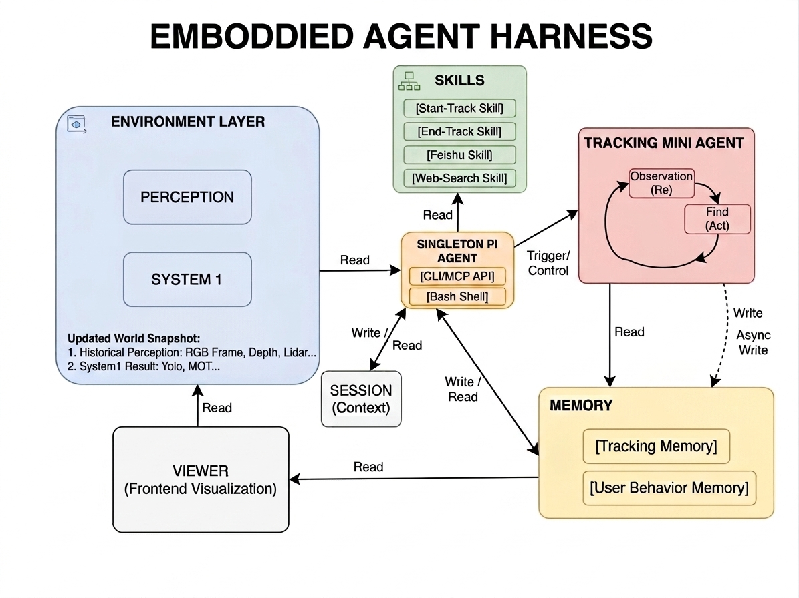

# Robot Agent Runtime

一个面向机器人的 `chat-first` Embodied Agent Kernel。

它关注的是机器人的 `System 2`：以对话为入口，以环境感知为依据，让 Agent 在物理世界里形成 `观察 -> 思考 -> 行动 -> 验证 -> 恢复` 的最小闭环。当前仓库以 `tracking` 和其它 skills 作为能力样例。



## Why

机器人底层的检测、跟踪、导航、避障、本体控制属于低延迟的 `System 1`。这个项目关心的是更上层的 `System 2`：当用户通过自然语言提出开放式目标后，Agent 如何读取当前世界、拆解任务、选择能力、提交动作、验证结果，并在偏差出现时恢复。

这套内核坚持几条硬边界：

- 入口是 `chat / script / interface`，不是感知线程自己驱动高层任务。
- `perception` 是唯一常驻输入层，持续提供世界快照，但不拥有高层编排权。
- `runner` 保持单一路径和单一动作提交权。
- agent-owned state 只有一份持久化 session truth。
- `tracking-init` 是一次性 skill；持续跟踪由同一条 session 内部的 mini Re/Act follow-up 承接。

`tracking` 是这套架构的 proof point，因为它天然要求：

- 自然语言指定目标
- 基于当前世界快照确认身份
- 遮挡 / 短时离场后的 rebind / recovery
- 图文 memory 维护
- 在持续运行中反复验证“当前跟踪的人是不是还是同一个人”

## Demo

最小可工作的主路径是 2 个进程，viewer 是可选界面：

终端 1，启动 write environment：

```bash
uv run robot-agent-environment-writer --source 0
```

终端 2，启动 PI TUI：

```bash
uv run e-agent
```

每次启动 `e-agent` 都会新建一条 runtime session，不复用旧 session id。

然后在 `pi` 中输入：

```text
开始跟踪穿黑衣服的人
继续跟踪
```

这条链路里会发生：

- write environment 持续写入 `perception/snapshot.json`，并同步维护 `perception/latest_frame.jpg` 作为当前视觉直达文件
- `tracking-init` skill 读取当前世界快照并确认目标
- session 中写入 tracking state、text memory、image crop memory
- `e-agent` 在同一条 session 内继续跑 continuous tracking mini Re/Act
- viewer 会直接轮询 session truth、perception snapshot、tracking memory 和当前画面文件，不依赖额外的 viewer 派生落盘
- viewer 只读这些本地文件，不参与调度

## Features

- `chat-first`：PI 对话是主入口。
- always-on perception：write environment 持续写世界快照和同帧 system1 结果。
- direct current-vision file：回答“现在你能看到什么”时优先读取 `perception/latest_frame.jpg`；`snapshot.json` 和历史帧继续作为结构化/历史真相。
- single runner path：高层任务推进和状态提交都走同一条 runner 路径。
- single session truth：agent-owned state 只有一份持久化 truth。
- tracking 双段式：`tracking-init` 做初始化，continuous mini-agent 做 review / rebind。
- read-only viewer：viewer 只负责观察状态，不承担调度逻辑。
- benchmark 对齐 runtime：tracking benchmark 默认走当前 continuous-tracking runtime path。

## Quick Start

环境要求：

- Python `3.9`
- `uv`
- `pi`（`e-agent` 默认会从 `PATH` 里直接执行它）

安装 `uv`：

```bash
curl -LsSf https://astral.sh/uv/install.sh | sh
```

macOS 也可以直接用：

```bash
brew install uv
```

安装 `pi`（全局安装即可，`uv run e-agent` 默认直接调用 `PATH` 里的 `pi`）：

```bash
npm install -g @mariozechner/pi-coding-agent
pi --help
```

把仓库里的示例配置复制到 `~/.pi/agent/models.json`：

```bash
mkdir -p ~/.pi/agent
cp ./docs/pi-models.dashscope.example.json ~/.pi/agent/models.json
```

Windows 下对应路径是 `%USERPROFILE%\\.pi\\agent\\models.json`。示例文件里的 `apiKey` 读取的是当前 shell 的 `DASHSCOPE_API_KEY`，所以启动 `pi` 或 `uv run e-agent` 前需要先导出这个环境变量；如果你已经在当前 shell 里执行过 `set -a && source .ENV && set +a`，这一步就已经满足了。

安装依赖：

```bash
uv sync
```

如果当前 shell 需要 `.ENV` 里的凭证（可能不需要手动运行）：

```bash
set -a && source .ENV && set +a
```

### 1. 启动 write environment

摄像头：

```bash
uv run robot-agent-environment-writer --source 0
```

文件流：

```bash
uv run robot-agent-environment-writer --source tests/fixtures/demo_video.mp4
```

对文件流，运行时会自动使用实时播放默认行为，不需要再额外传其它参数。

### 2. 启动 PI Agent TUI 文字交互和文字与语音交互

```bash
uv run e-agent
```

```bash
uv run e-agent --voice-input
```

### 3. 可选启动 viewer UI

```bash
cd interfaces/viewer
npm install
npm run dev
```

`e-agent` 默认会：

- bootstrap fresh session
- 以前台 supervisor 的方式拉起 `pi`
- 只加载仓库内 project skills
- 在同一条 session 上接管 continuous tracking follow-up

## Architecture

当前仓库的最小链路是：

```text
write environment
    -> perception snapshot
    -> same-frame system1 result

PI TUI / e-agent
    -> chat turn
    -> skill selection
    -> runner commit
    -> continuous tracking mini Re/Act

viewer
    -> read-only session + perception inspection
```

目录边界：

- `world/`: 常驻输入层。写 perception、frame artifact、snapshot、system1 result。
- `agent/`: active session、runner、state commit、`e-agent` supervisor。
- `capabilities/`: runtime-owned capability logic，例如 tracking runtime。
- `skills/`: 面向 `pi` 的 skill contract 和 skill-local helper，例如 tracking-init、tts、feishu、web-search。
- `interfaces/`: viewer 本地快照读取等只读界面。

tracking 的路径归属也要明确区分：

- `skills/tracking-init/` 只表示 `tracking-init` 这个一次性 skill。
- `skills/tracking-stop/` 只表示 stop/clear 这个一次性 skill。
- `capabilities/tracking/` 才是 continuous tracking 的 Python Re-Act runtime。

tracking 的核心结构：

```text
tracking-init skill
    -> 确认目标
    -> 初始化 memory
    -> 写入 tracking state

continuous tracking mini-agent
    -> derive trigger
    -> Re(snapshot)
    -> Act(decision)
    -> persist authoritative result
```

这里的 `loop` 指的是这段内部 continuous mini Re/Act 逻辑，不是独立 stack。

当前 `capabilities/tracking/` 的内部组织也保持分层但不框架化：

- `loop.py`: continuous tracking supervisor / trigger loop 的主入口
- `agent.py`: 单次 Re/Act turn
- `runtime/`: observation、trigger、authoritative writer、types 这些核心 runtime 原语
- `policy/`: select / memory rewrite / prompt templates / runtime references
- `state/`: tracking memory 持久化
- `artifacts/`: crop 和可视化输出
- `entrypoints/`: `tracking-init` / direct turn 这类一次性入口辅助
- `evaluation/`: benchmark 运行逻辑

## Usage

### 1. PI 里触发 tracking init，然后自动进入持续跟踪

先启动：

```bash
uv run robot-agent-environment-writer --source 0
uv run e-agent
```

然后在 `pi` 里说：

```text
开始跟踪穿黑衣服的人
```

成功完成 `tracking-init` 后，Agent 会在同一条 session 内自己接手 continuous tracking，不需要再单独起一个 tracking stack。

如果要看 UI，再单独启动：

```bash
cd interfaces/viewer
npm run dev
```

### 2. Benchmark 验证

直接跑默认 benchmark：

```bash
uv run robot-agent-tracking-benchmark
```

当前 benchmark 只保留一条 runtime-aligned 路径，不再暴露历史多 pipeline 模式。
benchmark 参数也只保留实际生效的 runtime-aligned 选项。

如果你本地还留着旧版 session state，当前版本不会兼容加载历史扁平结构的 `session.json`。
升级后请直接清空 `./.runtime/agent-runtime/` 再重启 runtime。

只跑某一个序列：

```bash
uv run robot-agent-tracking-benchmark --sequence corridor1
```

保存 JSON 报告：

```bash
uv run robot-agent-tracking-benchmark \
  --sequence corridor1 \
  --output-json ./.runtime/tracking-benchmark/corridor1.json
```
