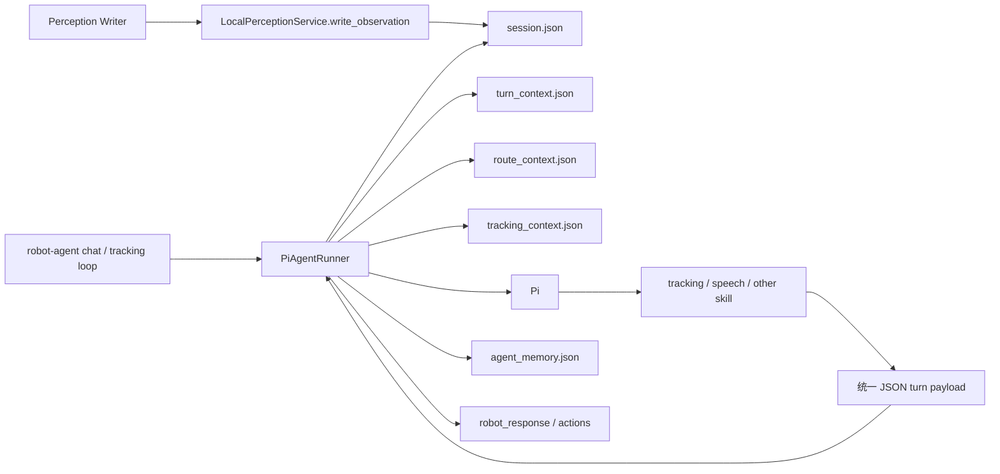
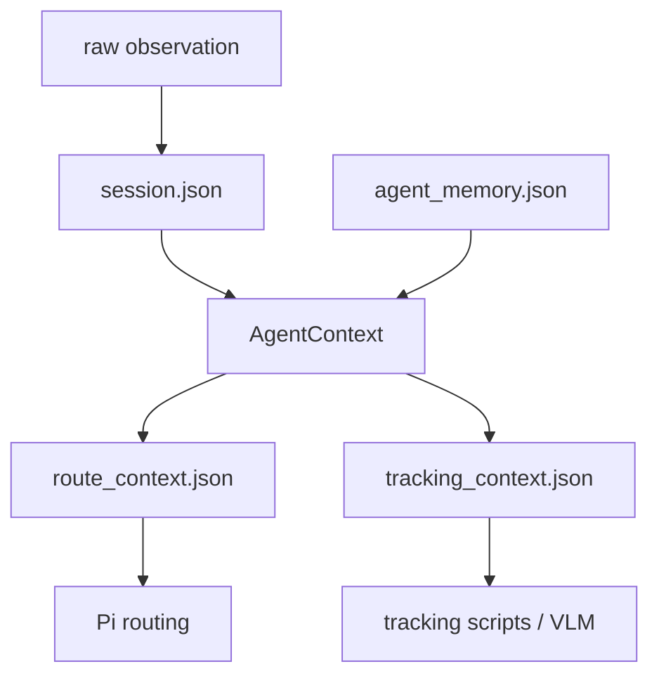
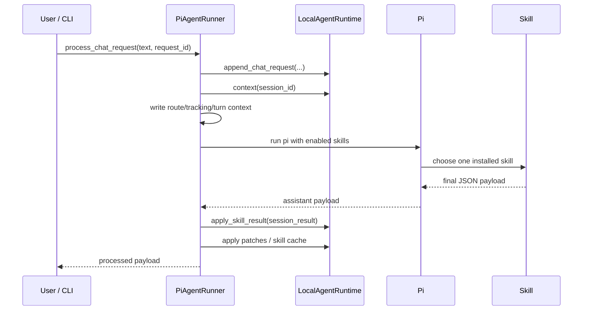
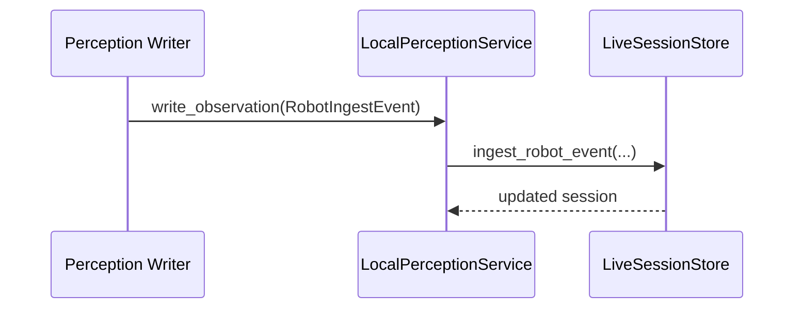
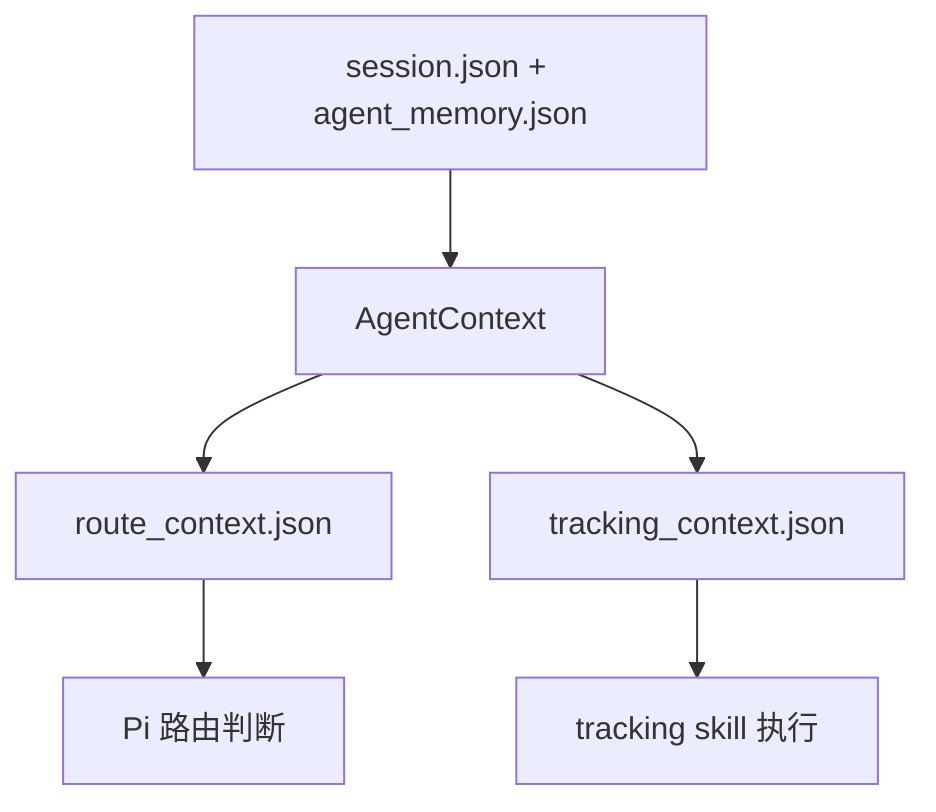
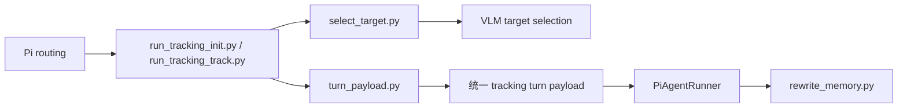
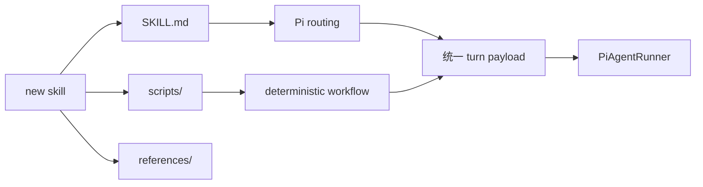

# Robot Agent Runtime 设计报告

## 摘要

这套系统的核心价值，不在于“把 tracking 跑起来”，而在于把机器人侧 Agent 运行时拆成了一个清晰、可扩展、可审计的结构：

- perception 只负责写环境事实，不替 Agent 做决策。
- agent runtime 只负责组织上下文、调用 Pi、回收结果、持久化状态。
- skill 只负责能力本身，不直接篡改底层状态文件。
- PiAgentRunner 把“一轮 Agent 调用”从一段隐式流程，收敛成一条可复盘的显式链路。

这使得当前的 `tracking` 不是一个特殊工程，而是第一个落地的 robot skill。`speech` 已经证明，这个 runtime 的形态天然支持 multi-skills，而不是围绕 tracking 写死的一套单技能框架。

一句话概括当前架构：

> perception 提供事实，runtime 组织事实，Pi 选择 skill，skill 产出结构化结果，runner 统一回写状态。

---

## 1. 报告结论

### 1.1 当前架构判断

当前项目已经具备一个通用 robot agent runtime 的基本形态，而不是“tracking 脚本集合”。其设计上最成立的三点是：

1. **状态所有权清晰**  
   `session.json` 管会话事实，`agent_memory.json` 管结构化记忆，skill 私有状态只进 `skill_cache["<skill>"]`。

2. **上下文工程是显式设计，不是临时拼 prompt**  
   Pi 不直接吃完整状态，而是先吃 `turn_context -> route_context -> tracking_context` 这样的裁剪上下文。

3. **调用链可审计**  
   每轮 Pi 调用都会留下 request artifacts，失败与结果都可追查，不是“模型说了什么只能看终端”。

### 1.2 当前最强的实现点

- `PiAgentRunner` 已经是一个真正的 turn orchestrator。
- tracking skill 的 `init` / `track` 被收敛成确定性入口脚本，减少了 Pi 内部自由发挥。
- memory rewrite 被明确拆成同步初始化和异步更新两条路径，符合实际运行成本。

### 1.3 当前最需要认清的事实

当前 `track` 主路径仍是 **VLM 驱动定位**，而不是纯确定性重绑定。代码里存在 `_deterministic_track_result(...)`，但还没有接到 `execute_select_tool(...)` 主流程。这一点必须在设计理解上说清楚，否则会高估系统的确定性程度。

---

## 2. 架构全景



这张图对应的不是抽象理想图，而是当前代码里的真实职责分配。

### 2.1 四层职责

| 层 | 目录 | 负责什么 | 不负责什么 |
| --- | --- | --- | --- |
| Perception | `backend/perception/` + `scripts/run_tracking_perception.py` | 抽帧、检测、写 observation | 技能路由、用户对话决策 |
| Runtime | `backend/agent/` | 组织上下文、调用 Pi、回写结果 | 具体 skill 逻辑 |
| Skill | `skills/<name>/` | 单项能力实现、skill 脚本、skill contract | 通用状态持久化 |
| Persistence | `backend/persistence/` | save/load session 与 active session | 持有业务语义 |

### 2.2 这套架构为什么成立

因为它不是按“代码来源”分层，而是按“状态与决策所有权”分层：

- perception 拥有的是观察输入。
- runtime 拥有的是 turn orchestration。
- skill 拥有的是能力语义。
- persistence 拥有的是文件落盘。

这比“后端一个大 orchestrator + 一堆脚本”更稳定，也更容易扩 skill。

---

## 3. 状态与所有权

### 3.1 状态设计图



这张图体现出一个关键原则：**原始状态不直接喂模型，先经过 runtime 投影成任务视图。**

### 3.2 `session.json`：短时会话事实

`session.json` 记录“这一轮系统看到了什么、说了什么、最近结果是什么”。

当前主字段：

- `latest_request_id`
- `latest_request_function`
- `latest_result`
- `result_history`
- `conversation_history`
- `recent_frames`

它的定位是“短时会话事实层”，所以适合放：

- 最近几帧
- 最近几轮结果
- 最近对话

但不适合放：

- tracking 的长期身份记忆
- skill 私有状态机
- 用户偏好和运行配置

### 3.3 `agent_memory.json`：结构化记忆层

`agent_memory.json` 的定位是“结构化、可持续、可复用的 agent 记忆层”。

它当前包含：

```json
{
  "user_preferences": {},
  "environment_map": {},
  "perception_cache": {},
  "skill_cache": {}
}
```

它和 `session.json` 的差别，不是“一个长一个短”，而是：

- `session.json` 记录发生过的 turn 事实
- `agent_memory.json` 记录后续 turn 需要复用的结构化状态

### 3.4 skill 状态为什么必须进 `skill_cache`

tracking 当前把这些内容存入 `skill_cache["tracking"]`：

- `target_description`
- `latest_target_id`
- `latest_target_crop`
- `latest_confirmed_frame_path`
- `identity_target_crop`
- `latest_confirmed_bbox`
- `pending_question`
- `latest_memory`

这套设计的说服力在于：  
它让 tracking 的业务状态不会污染全局 session schema。后续新增 navigation、manipulation、speech-dialog 时，也都能各自占一个命名空间。

---

## 4. 一轮 Agent 调用是如何发生的

### 4.1 用户 chat 路径



### 4.2 perception 路径



这条路径的关键不是“写了帧”，而是它**默认不污染对话历史**。  
perception 写入的是 observation，不是 chat turn；runtime 只是在后续 turn 中读取这些已落盘的 observation。

### 4.3 tracking loop 快路径

`scripts/run_tracking_loop.py` 在有活动目标时不会重复走完整 skill routing，而是直接调用：

- `PiAgentRunner.process_tracking_request_direct(...)`

这不是绕开架构，而是利用架构提供的快路径：

- 仍写 `tracking_context.json`
- 仍返回统一 payload
- 仍由 runner 做统一回写

这说明 runtime 设计不是“只能走一条路”，而是支持通用路径与高频专用路径并存。

---

## 5. PiAgentRunner：整个系统的编排核心

如果要挑一个最该读懂的类，就是 `backend/agent/runner.py` 中的 `PiAgentRunner`。

### 5.1 它真正解决的问题

它把一个原本容易失控的流程：

> 读状态 -> 拼 prompt -> 跑 Pi -> parse 输出 -> 回写状态 -> 再处理副作用

收敛成了一个明确、稳定、可复用的 turn pipeline。

### 5.2 它的职责不是“代替 skill”

`PiAgentRunner` 负责：

- 追加 turn
- 生成 context 文件
- 决定启用哪些 skill
- 调 Pi
- 解析最终 JSON
- 按统一 schema 落盘
- 编排 tracking memory rewrite

它不负责：

- 解释 tracking 业务
- 拼 tracking 的目标选择逻辑
- 决定机器人具体动作策略

这使它是一个通用 orchestrator，而不是 tracking adapter。

### 5.3 它为什么是 report 里必须单独讨论的一章

因为它是整个 runtime 的“收口点”：

- 所有 skill 最终都必须向它交付同一类 payload。
- 所有状态最终都由它统一回写。
- 所有多技能扩展最终都要经过它的装载与路由约束。

没有这层，multi-skills 会退化成“一堆脚本之间互相写文件”。

### 5.4 `process_chat_request(...)`

这是标准对话入口。顺序非常清楚：

1. 把用户输入追加到 `conversation_history`
2. 更新 `perception_cache.language`
3. 调 `process_session(...)`
4. 运行 Pi
5. 按 payload 回写状态

它的意义在于：  
**把“用户说了一句话”显式变成一个 turn。**

### 5.5 `process_session(...)`

这个方法做两件关键事：

1. 解析本轮启用 skill 列表
2. 调 `_run_pi_turn(...)` 并处理 `idle` / `processed`

这里的 skill 装载来源有两种：

- CLI 显式 `--skill`
- `environment_map["agent_runtime"]["enabled_skills"]`

这使 runtime 可以既支持临时覆盖，也支持 session 级默认配置。

### 5.6 `_run_pi_turn(...)`

这是 runner 的执行核心。它的说服力来自三个设计动作：

#### 第一，先落上下文文件，再调模型

每轮都会生成：

```text
.runtime/pi-agent/requests/<session_id>/<request_id>/
  route_context.json
  tracking_context.json
  turn_context.json
  pi_prompt.md
  pi_stdout.jsonl
  pi_stderr.txt
```

这意味着：

- 输入可追溯
- 输出可追溯
- 失败可复现

#### 第二，把 Pi 的自由度限制在技能选择与技能执行

Pi prompt 里明确规定：

- 先读 `route_context`
- tracking 时优先读 `tracking_context`
- 不要直接改状态文件
- 只返回一个原始 JSON 对象

这不是“提示工程细节”，而是整个 runtime 稳定性的关键控制面。

#### 第三，允许失败重试，但只重试可重试错误

当前实现最多尝试 3 次，但仅对如下问题重试：

- 未返回有效 turn payload
- 超时

这避免把真正的业务错误错误地“重试掩盖掉”。

### 5.7 `_apply_processed_payload(...)`

这是 runner 最重要的落盘函数。它按固定顺序处理：

1. `session_result`
2. `latest_result_patch`
3. `user_preferences_patch`
4. `environment_map_patch`
5. `perception_cache_patch`
6. `skill_state_patch`
7. tracking rewrite 任务

这个顺序体现了一种很好的工程判断：

- 先落最小可用 turn 结果
- 再做附加 patch
- 最后处理可能更重的后置任务

### 5.8 tracking rewrite 的同步 / 异步切分

这是当前 runner 设计里最“像真实机器人系统”的地方。

#### `init`

- 成功后同步执行 `rewrite_memory.py`
- turn 完成时，session 已经有初始化 memory

#### `track`

- 成功后异步调 worker
- 主 turn 不等待 memory 更新完成

原因非常实际：

- 初始化没有 memory，就等于没完成身份建立
- 持续跟踪是高频动作，不能被 memory 更新阻塞

这不是性能优化，而是业务优先级排序。

### 5.9 `process_tracking_request_direct(...)`

tracking loop 用这个方法直接跑：

- 生成 `tracking_context.json`
- 调 `run_tracking_track.py`
- 若失败，降级成 `wait` payload
- 仍走 `_apply_processed_payload(...)`

这说明 runner 不只是“Pi 的代理”，还是“统一状态入口”。

---

## 6. Context Engineering：不是把状态全塞给模型

当前代码的一个关键优点，是它已经形成了清晰的上下文工程分层。

### 6.1 三层上下文



### 6.2 `AgentContext`：runtime 内部总视图

`AgentContext` 聚合：

- `raw_session`
- `user_preferences`
- `environment_map`
- `perception_cache`
- `skill_cache`
- `state_paths`

它是 runtime 的内部标准视图，不直接暴露给 Pi。这个动作很重要，因为 runtime 可以控制“给模型看什么，不给模型看什么”。

### 6.3 `turn_context.json`：本轮执行入口

Pi 首先读取这个文件。它不承载业务细节，而承载“本轮工作说明书”：

```json
{
  "session_id": "sess_xxx",
  "request_id": "req_xxx",
  "context_paths": {
    "route_context_path": "...",
    "tracking_context_path": "..."
  },
  "state_paths": {
    "session_path": "...",
    "agent_memory_path": "..."
  },
  "env_file": ".../.ENV",
  "artifacts_root": ".../.runtime/pi-agent",
  "enabled_skills": ["tracking", "speech"]
}
```

这个设计非常有说服力，因为它让 Pi 不需要“猜系统约定”，而是明确知道：

- 该读什么
- 哪些 skill 已启用
- 如果被阻塞，原始状态文件在哪里

### 6.4 `route_context.json`：面向 skill routing 的最小视图

它只保留路由需要的字段：

- `latest_user_text`
- `recent_dialogue`
- `latest_frame` 摘要
- `latest_result`
- `tracking` 摘要
- `enabled_skills`

这反映出一个很成熟的判断：

> skill 路由阶段需要的是“足够判断”，不是“全量事实”。

### 6.5 `tracking_context.json`：tracking 的专属操作视图

它把 tracking 真正要用的状态打包出来：

- `target_description`
- `memory`
- `latest_target_id`
- `latest_target_crop`
- `latest_confirmed_frame_path`
- `identity_target_crop`
- `latest_confirmed_bbox`
- `init_frame_snapshot`
- `chat_history`
- `frames`

这比让 tracking 脚本自己去翻 `session.json` 与 `agent_memory.json` 更可靠，因为：

- 字段已经规范化
- 历史已经裁剪
- 路径已经统一

### 6.6 历史裁剪不是缩水，而是降噪

当前历史保留策略：

- `conversation_history` 最多 8 条
- `result_history` 最多 8 条
- `route_context` 默认取最近 6 条对话
- `tracking_context` 默认取最近 6 条对话

它背后的判断是对的：

- 对 skill routing 来说，旧历史很容易成为噪声
- 对 tracking disambiguation 来说，最近几轮对话最重要
- 对模型来说，“少而准”的上下文比“多而乱”的上下文更有价值

---

## 7. tracking skill：当前系统里最完整的能力闭环

tracking skill 是目前最能体现这套 runtime 设计思想的模块。

### 7.1 tracking 不是长循环，它是单轮 skill

`skills/tracking/SKILL.md` 明确了这一点：

- tracking skill 只负责单轮 `init` / `track` / `reply`
- perception loop 不属于它
- tracking runtime loop 也不属于它

这让长期循环与单轮推理解耦，避免 skill 膨胀成一整个系统。

### 7.2 tracking 的两层结构



这个设计很关键：  
Pi 不直接手工拼 tracking payload，而是调用 skill 自带的确定性入口脚本。

### 7.3 为什么这个结构比“直接在 Pi 里写逻辑”更好

因为 tracking 里有大量脆弱流程：

- 候选框选择
- crop 生成
- reference frame 保存
- memory rewrite 触发
- payload 组装

这些流程如果分散在 Pi 对话中，会非常难以稳定。  
当前做法是：**让 Pi 只做路由和调用，让脚本做精确流程。**

---

## 8. 当前 VLM 调用报告

这一章只讨论“当前真实发生的模型调用”，不讨论未来可能接入的调用。

### 8.1 总览

| 调用 | 入口 | 用途 | 输入图像 | 输出类型 |
| --- | --- | --- | --- | --- |
| VLM-1 | `select_target.py` / `init` | 在候选人中初始化目标 | 1 张 overlay 图 | 目标选择 JSON |
| VLM-2 | `select_target.py` / `track` | 依据 memory 和参考帧继续绑定目标 | 参考帧 + 当前 overlay 图 | 目标选择 JSON |
| VLM-3 | `rewrite_memory.py` | 初始化或更新 tracking memory | crop + frame(s) | memory JSON |

### 8.2 调用一：`init` 目标选择

#### 触发条件

- 用户发起目标初始化
- 用户未显式指定一个可直接命中的 candidate ID

#### 输入

文本 instruction 来自 `robot-agent-config.json.prompts.init_skill_prompt`，包含：

- `target_description`
- `candidates`

图像输入：

- 当前候选框 overlay 图 1 张

输出 contract：

```json
{
  "found": true,
  "bounding_box_id": 12,
  "text": "给用户的简短回复",
  "reason": "简短解释",
  "needs_clarification": false,
  "clarification_question": null
}
```

#### 这一调用为什么合理

因为 `init` 场景的本质是“把自然语言描述对齐到候选框 ID”，它最需要的是：

- 用户描述
- 当前画面候选框

而不是长期历史。

### 8.3 调用二：`track` 继续绑定 / 重绑定

#### 触发条件

- 用户要求继续跟踪
- 用户未显式指定目标 ID

#### 输入

文本 instruction 来自 `track_skill_prompt`，显式注入：

- `memory`
- `latest_target_id`
- `candidates`
- `user_text`
- `recent_dialogue`

图像输入 2 张：

1. 最近一次确认目标的历史参考帧
2. 当前候选框 overlay 图

输出 contract 与 `init` 同形。

#### 这一调用为什么重要

它说明当前 tracking 的核心不是“只看当前框”，而是：

> 用结构化 tracking memory 和历史参考帧，把同一身份延续到当前候选人集合中。

#### 当前实现上的真实判断

- 显式 ID 指令优先，不调 VLM
- 非显式 ID 的 `track` 主路径仍然调 VLM
- `_deterministic_track_result(...)` 存在，但未接入主流程

这说明系统当前是“VLM 主导的持续身份绑定”，而不是“确定性 matcher 主导”。

### 8.4 调用三：memory 初始化 / 更新

#### 触发条件

- `init` 成功：同步 `task="init"`
- `track` 成功：异步 `task="update"`

#### 输入

文本 instruction：

- `memory_init_prompt`
- 或 `memory_optimize_prompt`

其中 `update` 会显式注入旧 memory：

```json
{
  "current_memory": {
    "appearance": {...},
    "distinguish": "...",
    "summary": "..."
  }
}
```

图像输入：

- 第 1 张：目标 crop
- 第 2..N 张：参考 frame，当前实现通常为当前确认帧

输出 contract：

```json
{
  "appearance": {
    "head_face": "",
    "upper_body": "",
    "lower_body": "",
    "shoes": "",
    "accessories": "",
    "body_shape": ""
  },
  "distinguish": "",
  "summary": ""
}
```

#### 为什么这套 memory 设计是对的

因为它不是自然语言长摘要，而是面向下轮定位的结构化外观记忆：

- 细粒度
- 可保留旧值
- 可局部更新
- 可直接注入下一轮 prompt

这比把“上一轮模型输出的一段话”直接拼回 prompt 稳定得多。

---

## 9. 输入输出契约：为什么这个 runtime 容易扩 skill

### 9.1 所有 skill 共享同一顶层 payload

Pi 或 skill 最终必须返回：

```json
{
  "status": "idle" | "processed",
  "skill_name": "<skill-name>" | null,
  "session_result": object | null,
  "latest_result_patch": object | null,
  "skill_state_patch": object | null,
  "user_preferences_patch": object | null,
  "environment_map_patch": object | null,
  "perception_cache_patch": object | null,
  "robot_response": object | null,
  "tool": string | null,
  "tool_output": object | null,
  "rewrite_output": object | null,
  "rewrite_memory_input": object | null,
  "reason": string | null
}
```

这套协议非常关键，因为它让 runner 只需要理解“payload 语义”，而不需要理解“每个 skill 的内部实现”。

### 9.2 tracking 的 canonical `session_result`

tracking 成功结果的核心字段保持稳定：

```json
{
  "behavior": "init" | "track",
  "frame_id": "frame_000123",
  "target_id": 12,
  "bounding_box_id": 12,
  "found": true,
  "text": "已确认跟踪 ID 为 12 的目标。",
  "reason": "brief explanation"
}
```

这套字段命名稳定的意义很大：

- session 历史更可读
- action 层更容易消费
- 新 skill 也会被迫形成清晰 contract

---

## 10. Multi-Skills：当前架构为什么天然支持多技能

### 10.1 不是“tracking + 例外”，而是“skill system + 一个 tracking 实现”

当前多技能设计的核心不是写一个总调度表，而是三件事：

1. skill 自描述：`skills/<name>/SKILL.md`
2. runtime 装载：只把启用 skill 传给 Pi
3. 统一结果协议：全部技能都回统一 payload

### 10.2 一个新 skill 如何接入

正确接入路径应该是：



这条接入路径的价值在于：

- skill 可以自由演化
- runtime 无需写 skill-specific adapter
- skill 只需要遵守 payload contract

### 10.3 `speech` 的意义

`speech` 目前不依赖 perception，但它已经证明：

- runtime 不依赖 tracking 私有概念
- 一个非视觉 skill 也能使用同一顶层 payload
- 多技能 runtime 的方向是成立的

换句话说，tracking 不是特例，tracking 只是第一个“用到视觉上下文和 memory rewrite”的 skill。

---

## 11. perception 如何支撑不同 skills

### 11.1 perception 的抽象不是 tracking-specific

当前 perception 层抽象出来的是：

- 最近帧
- 最近检测结果
- 最近语言输入摘要
- runtime 结果摘要
- 用户偏好与环境配置

这是一组通用“环境事实”，不是 tracking 私有状态机。

### 11.2 `PerceptionBundle` 是通用底座

`build_perception_bundle(context)` 返回：

- `vision`
- `language`
- `memory`
- `user_preferences`
- `environment_map`

这意味着未来 skill 不需要直接懂 tracking，也可以获得：

- 最近看到了什么
- 最近用户说了什么
- 目前系统处于什么状态

### 11.3 专用上下文由 runtime 再投影

当前设计不是：

> 给所有 skill 一个巨大的统一 JSON，让 skill 自己去筛字段

而是：

> 先有一个统一 perception / context 底座，再按 skill 生成最小 specialized context

tracking 已经验证了这套方法：

- 通用：`route_context`
- 专用：`tracking_context`

如果后续加 navigation / manipulation / scene-understanding skill，最合理的做法也应该一样：  
在 runtime 里增加对应的 context builder，而不是让 skill 到处翻原始状态文件。

### 11.4 这套设计对 robot agent 尤其重要

机器人场景和普通 chat agent 的区别在于：

- 输入有时序
- 输入有图像
- 输入有频率
- 输入有错误积累

因此 perception 必须是“事实层”，skill 必须是“解释层”。  
当前架构恰好符合这一点。

---

## 12. 历史、保留与可审计性

### 12.1 保留策略

当前系统的历史管理是克制的：

- `conversation_history` 最多 8 条
- `result_history` 最多 8 条
- `recent_frames` 默认保留 3 帧
- `events.jsonl` 默认裁到最近 300 行

这不是保守，而是为实时系统减噪。

### 12.2 request artifacts 的意义

每轮 Pi 调用都会保留下来：

- 输入上下文
- prompt
- stdout
- stderr

这让系统具备了一个很重要的工程特征：  
**每个 turn 都可复盘。**

对于 agent 系统，这比“代码结构整洁”更重要，因为排障的核心不只是看代码，还要看“那一轮到底喂给模型了什么”。

### 12.3 当前没有完整后端 memory ledger

当前 tracking 只在后端持久化：

- 最新 memory
- 最新结果与短历史
- request artifacts

它没有单独维护一条无限增长的 memory 版本账本。  
这意味着当前系统更强调“最新可用状态”和“每轮可审计输入输出”，而不是“完整 memory 演化史”。

这是一个清醒取舍，不是缺失；但如果未来要做更强分析和回放，这会是下一步扩展点。

---

## 13. 设计说服力与下一步判断

### 13.1 这套设计最有说服力的地方

最有说服力的不是它“功能很多”，而是它在几个关键问题上做了正确切分：

- 状态所有权切分对了
- 模型上下文裁剪对了
- turn orchestration 收口对了
- skill 接入方式收敛对了
- tracking 的昂贵后置任务分流对了

这些点一旦切对，系统就会稳。

### 13.2 当前最值得继续演进的方向

如果后续继续往“真正通用的 robot multi-skills runtime”推进，优先级最高的几件事会是：

1. 把 tracking 的确定性 rebind 路径真正接入主流程，形成 VLM + deterministic 的层级决策。
2. 为新 skill 增加对应的 context builder，而不是让 skill 自己读原始状态。
3. 视需求引入 memory versioning / report snapshot，用于长期调试和回放分析。

### 13.3 最终判断

当前项目已经不是“带 tracking 的 demo runtime”，而是一个结构上成立的 robot agent runtime 雏形。  
它最核心的资产不是某个 prompt，也不是某个脚本，而是：

> 已经形成了一个清晰的 turn 边界、状态边界和 skill 边界。

这正是后续做 multi-skills、做更稳定的 perception-to-action agent 所必需的骨架。

---

## 附：推荐阅读顺序

如果要从代码进入这套设计，最推荐的阅读顺序是：

1. `backend/agent/runner.py`
2. `backend/agent/context_views.py`
3. `backend/agent/runtime.py`
4. `backend/persistence/live_session_store.py`
5. `skills/tracking/SKILL.md`
6. `skills/tracking/scripts/run_tracking_init.py`
7. `skills/tracking/scripts/run_tracking_track.py`
8. `skills/tracking/scripts/select_target.py`
9. `skills/tracking/scripts/rewrite_memory.py`

这是从“总编排”进入“具体 skill 落地”的最短路径。
